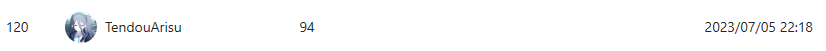

# study_report
study plan and report of rust and OS

------------------------------
The first week plan:

rustlings训练(全部)

《深入理解计算机系统》(CSAPP)前八章

------------------------------

## Content

- [study\_report](#study_report)
  - [Day1（2023.7.3）](#day1202373)
  - [Day2（2023.7.4）](#day2202374)
  - [Day3（2023.7.5）](#day3202375)
  - [Day4（2023.7.6）](#day4202376)
  - [Day5（2023.7.7）](#day5202377)
  - [Day6（2023.7.8）](#day6202378)
  - [Day7（2023.7.9）](#day7202379)
  - [Day8（2023.7.10）](#day82023710)
  - [Day9（2023.7.11）](#day92023711)
  - [Day10（2023.7.12）](#day102023712)
  - [Day11（2023.7.13）](#day112023713)
  - [Day12（2023.7.14）](#day122023714)
  - [Day13（2023.7.15）](#day132023715)
  - [Day15（2023.7.17）](#day152023717)
  - [Day24（2023.7.26）](#day242023726)
  - [Day25（2023.7.27）](#day252023727)
  - [Day26（2023.7.28）](#day262023728)
  - [Day27（2023.7.31）](#day272023731)
  - [Day28（2023.8.1）](#day28202381)
  - [Day29（2023.8.2）](#day29202382)
  - [Day30（2023.8.3）](#day30202383)
  - [Day31（2023.8.4）](#day31202384)
  - [Day32（2023.8.7）](#day32202387)
  - [Day33（2023.8.8）](#day33202388)
  - [Day34（2023.8.9）](#day34202389)
  - [Day35（2023.8.10）](#day352023810)
  - [Day36（2023.8.11）](#day362023811)
  - [Day37（2023.8.14）](#day372023814)
  - [Day38（2023.8.15）](#day382023815)
  - [Day39（2023.8.16）](#day392023816)
  - [Day40（2023.8.17）](#day402023817)
  - [Day41（2023.8.18）](#day412023818)
  - [Day42（2023.8.21）](#day422023821)

------------------------------
##  Day1（2023.7.3）

rustlings训练完成1~45题，做题的同时复习rust语法和用法，发现许多地方遗忘较多，需要进一步复习。

##  Day2（2023.7.4）

rustlings训练完成46~60题。

《深入理解计算机系统》(CSAPP)，通过b站粗略学习一二章，还需巩固。

暂定后两天复习语法并完成rustlings训练。

同时每天至少学习一章CSAPP

##  Day3（2023.7.5）

rustlings训练完成61~95题(全部完成），今日主要做题，发现许多概念先前未学习以及遗忘，需要更多时间复习rust语法。

rust用法仍不熟练，许多题目借助编译器以及提示才较好完成，代码量不够。

打算根据rustlings习题分类顺序复习。

今日巩固CSAPP第一二章节，明天开始赶进度。

首要目标：完成CSAPP学习

次要目标：rust巩固 （慢慢来，计划每日巩固较小部分但尽可能吃透，延伸至下周，视情况提前）

##  Day4（2023.7.6）

完成CSAPP一二章学习，并做了详细笔记。

第三章学习初步完成，笔记完成部分，感觉汇编要记得东西比较多，只了解了原理，具体用法需要查表。

第四章开头。

今明完成学校作业可能会占用一定时间，明天完成三四章，第五章开头，尽力完成第五章。

晚些完成练习题。

rust复习缓缓。

##  Day5（2023.7.7）

完成CSAPP一二三章课后练习。

完成第三章四章学习。

第五章开头。

学校作业占用了一定时间，接下来两天一天两章。

##  Day6（2023.7.8）

完成五六章学习。

##  Day7（2023.7.9）

完成七八章学习。

##  Day8（2023.7.10）

完成CSAPP测验，复习考试内容。

##  Day9（2023.7.11）

学习OSTEP 1-6， 配置rust tutorial 环境。

##  Day10（2023.7.12）

slides 1-2 开始看RTB

##  Day11（2023.7.13）

完成学校学习内容和作业

##  Day12（2023.7.14）

完成lab0

##  Day13（2023.7.15）

两天回老家

##  Day15（2023.7.17）
准备学校期末考试等事项

##  Day24（2023.7.26）

复习先前内容

##  Day25（2023.7.27）

看OSTEP 7-12，继续复习

##  Day26（2023.7.28）

RTB第二章学习，第三章开头

##  Day27（2023.7.31）

RTB第三章学习

##  Day28（2023.8.1）

巩固RTB内容，开始做lab1

##  Day29（2023.8.2）

lab1 完成中

##  Day30（2023.8.3）

lab1 完成

##  Day31（2023.8.4）

复习RTB 2-3， 开始看OSTEP13-22

##  Day32（2023.8.7）

学习OSTEP13-22

##  Day33（2023.8.8）

看slide5-6 RTB第四章

##  Day34（2023.8.9）

继续学习RTB第四章

##  Day35（2023.8.10）

继续研究RTB第四章，开始写lab2

##  Day36（2023.8.11）

lab2完成三分之一，复习OSTEP和RTB，继续做lab2

##  Day37（2023.8.14）

lab2基本完成，继续debug

##  Day38（2023.8.15）

lab2完成，开始学习RTB第五章

##  Day39（2023.8.16）

学习RTB第五章，复习OSTEP

##  Day40（2023.8.17）

继续复习，今天抢学校课

##  Day41（2023.8.18）

开始做lab3，参与ros小车测试

##  Day42（2023.8.21）

本周基本都在搞ROS小车
